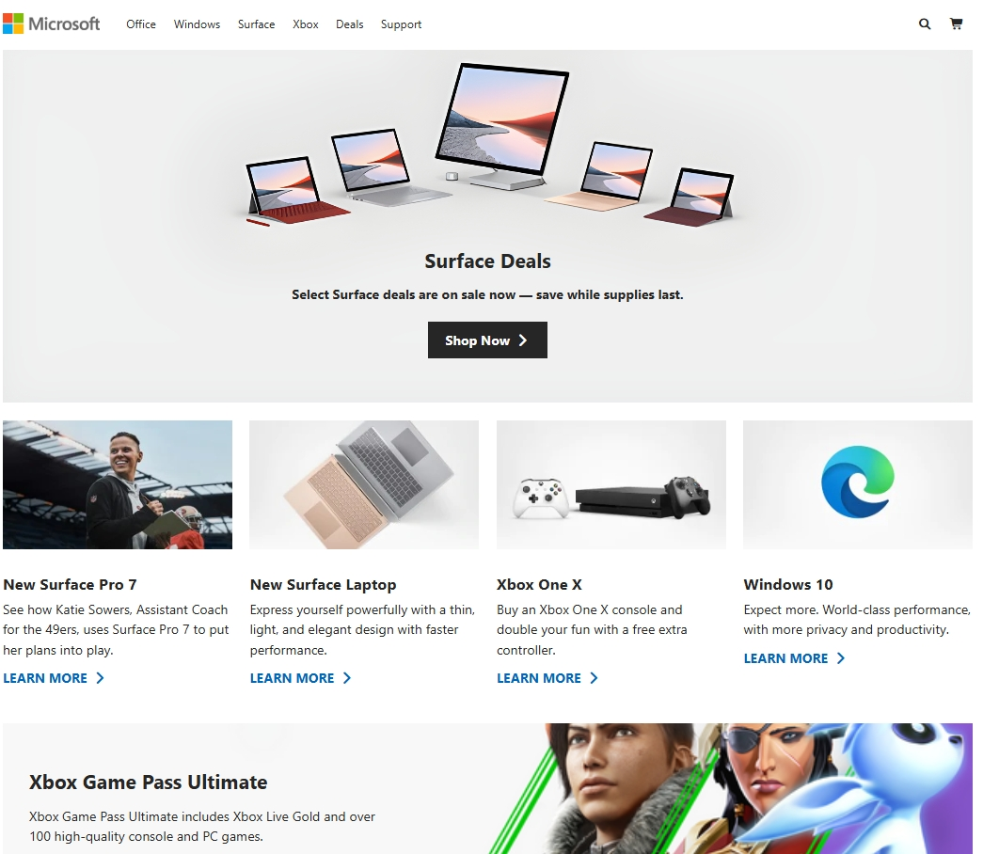
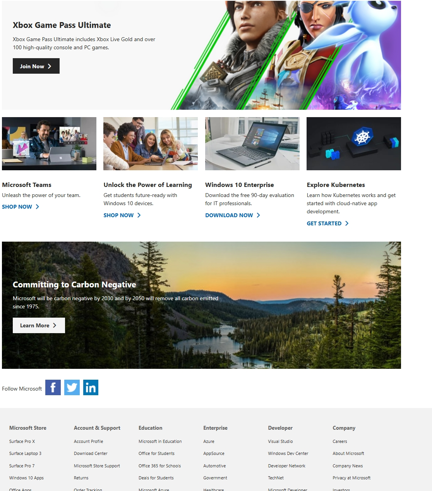
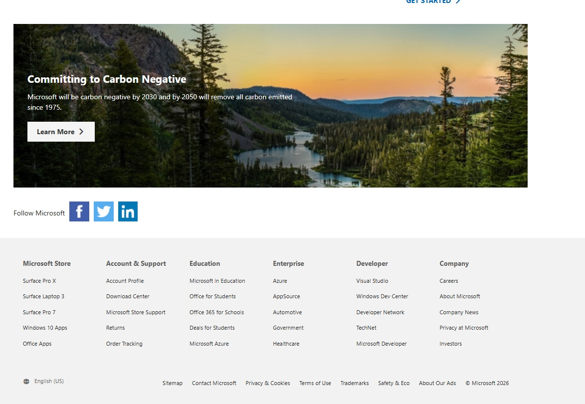
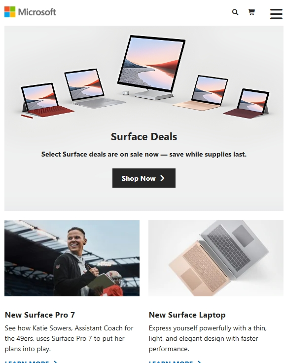
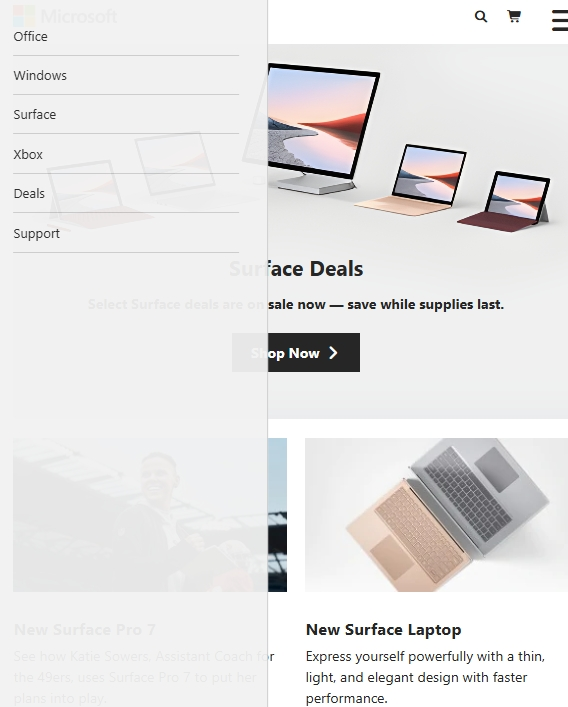

# Microsoft Landing Page Clone

A responsive Microsoft homepage clone built using HTML, CSS, and JavaScript.

## Features

- Responsive Navbar
- Mobile Menu Toggle
- Hero Showcase Section
- Product Cards
- Xbox & Carbon Sections
- Footer with Multiple Columns
- Smooth Hover Effects

## Technologies Used

- HTML5
- CSS3
- JavaScript
- Font Awesome

## Screenshots

## Author

Swaraj Xavier
